# Cancer RLTO Model: Comprehensive Stress Test, Architecture, & Edge Case Analysis

---

## 1. Objective

The objective of this analysis was to rigorously stress-test a Cancer RLTO (Robustness–Load Trade-Off) model using a
deliberately constructed synthetic “Rogue’s Gallery” of genes. These genes span extreme biological regimes—zero
essentiality, infinite benefit scenarios, high stochastic noise, extreme toxicity, and near-zero abundance—to ensure the
optimizer behaves predictably, deterministically, and without numerical instability across boundary conditions.

---

## 2. Model Architecture & Mathematical Primer

### Core Philosophy

Tumor cells operate under a constrained evolutionary optimization problem:

* Increasing protein abundance improves **robustness** against stochastic fluctuations.
* However, overexpression introduces:

    * **Metabolic burden** (ATP/ribosomal cost)
    * **Toxicity** (aggregation, pathway dysregulation)

Thus, each gene operates under a **trade-off between survival probability and resource cost**.

---

### Gamma Distribution & Noise

Protein abundance is not deterministic. It follows a **Gamma distribution**:

* Shape: governed by transcriptional burstiness
* Scale: determined by mean abundance

To remain viable, the protein level ( X ) must exceed a critical threshold ( \tau_i ).

The survival probability is:

[
P(X \ge \tau_i)
]

This is computed analytically via the **regularized upper incomplete gamma function** (`gammaincc`), eliminating
stochastic noise.

---

### Component Equations

#### Net Gene Fitness

[
F_i(x_i) = R_i(x_i) - B_i(x_i) - T_i(x_i)
]

---

#### Robustness Benefit

[
R_i(x_i) = S \cdot E_i \cdot P(X \ge \tau_i)
]

* ( S ): global scaling factor
* ( E_i ): essentiality
* ( P(X \ge \tau_i) ): survival probability

This term **plateaus** once survival probability approaches 1.

---

#### Burden Cost

[
B_i(x_i) = c_b \cdot w_{b,i} \cdot x_i
]

* Linear scaling
* Represents ATP and translational cost

---

#### Toxicity Cost

[
T_i(x_i) = c_t \cdot w_{t,i} \cdot x_i^{1.25}
]

* Superlinear penalty
* Captures aggregation and oncogenic toxicity

---

### Global Tumor Fitness

[
F_{global}(\mathbf{x}) = \frac{1}{N} \sum_{i=1}^{N} F_i(x_i) - \lambda \left( \frac{\sum x_i}{X_{baseline}} \right)^2
]

Interpretation:

* First term: mean gene fitness
* Second term: **quadratic resource penalty**

This enforces a **hard trade-off**: increasing one gene forces reduction in others.

---

### Optimizer

* Gene-level: `minimize_scalar` (bounded)
* Global-level: `SLSQP`
* Fully deterministic due to analytical Gamma CDF

---

## 3. Global System Metrics

* **Best Global Fitness:** **5.8508**
* **Optimal Inhibition (TOXIC_DRIVER):** **~0.000006 (≈ 0%)**

### Interpretation: The Inhibition Paradox

The optimizer suggests **no inhibition** of the TOXIC_DRIVER.

Reason:

* Despite its toxicity, reducing it further **removes already minimized burden**, slightly reducing system adaptability.
* The system has already pushed this gene near-zero; further intervention yields negligible gain.

---

## 4. Gene Analysis Categories (Stress Test)

---

## A. Boundary Hitters

### MAGIC_BULLET — The Free Lunch

* **Parameters:**

    * Essentiality: **1.0**
    * Burden: **0**
    * Toxicity: **0**

* **Data:**

    * Baseline: **863.19**
    * Optimal: **17263.71 (20× upper bound)**

### Explanation

With **no penalties**, fitness reduces to:

[
F_i \approx R_i
]

Thus, optimizer pushes abundance to the **maximum allowed bound**.

### Plots

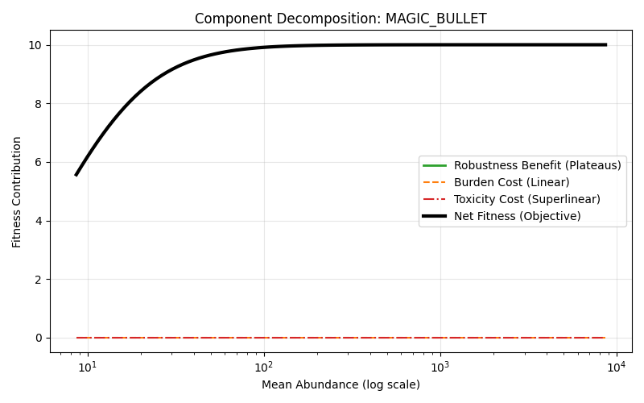

---

### PASSENGER — The Useless Gene

* **Parameters:**

    * Essentiality: **0**
    * Burden/Toxicity: **> 0**

* **Data:**

    * Baseline: **575.46**
    * Optimal: **~0**

### Explanation

[
R_i = 0 \Rightarrow F_i = -B_i - T_i
]

The optimizer collapses expression to **zero**.

### Plots

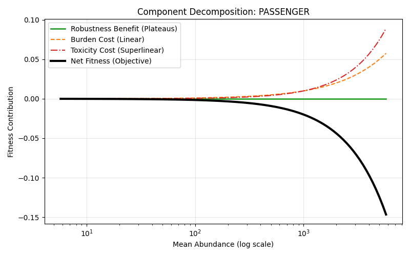

---

## B. Noise-Driven Extremes

### CHAOS_GENE — High Noise Regime

* **Parameters:**

    * Burstiness: **15.0**
    * Regulation: **0**

* **Data:**

    * Baseline: **575.46**
    * Optimal: **10492.90**

### Explanation

High variance → wide Gamma distribution → high probability of falling below threshold.

To compensate:

[
x_i \uparrow \Rightarrow P(X \ge \tau_i) \uparrow
]

Optimizer drives **massive overexpression**.

### Plots

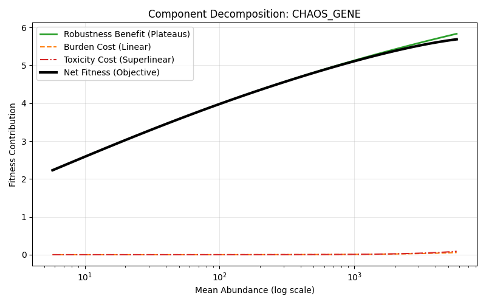

---

### HOUSEKEEPER — Ultra-Stable Gene

* **Parameters:**

    * Burstiness: **0.1**
    * Regulation: **5.0**

* **Data:**

    * Baseline: **7912.53**
    * Optimal: **1.85**

### Explanation

Low variance → tight distribution.

Thus:

[
P(X \ge \tau_i) \approx 1 \text{ even at low } x_i
]

Optimizer minimizes cost → **collapses abundance to threshold proximity**.

### Plots

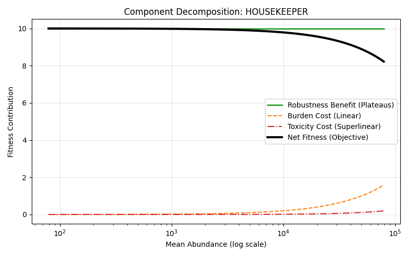

---

## C. Burden and Toxicity Suppression

### TOXIC_DRIVER — Overexpressed Oncogene

* **Parameters:**

    * Transcription: **25**
    * Oncogenic boost: **2**
    * Toxicity: **0.15**

* **Data:**

    * Baseline: **21579.63**
    * Optimal: **13.05**

### Explanation

Toxicity term dominates:

[
T_i \sim x^{1.25}
]

Optimizer aggressively suppresses expression.

### Plots

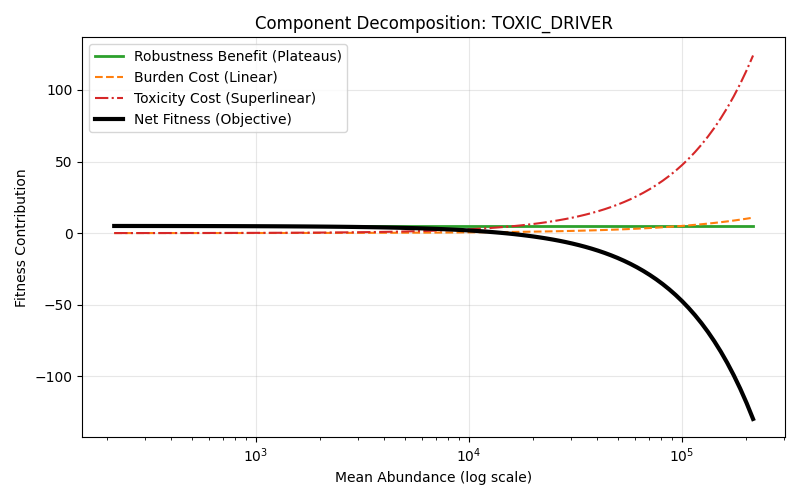

---

### STRUCTURAL — Linear Burden Dominance

* **Parameters:**

    * Burden: **0.1**
    * Toxicity: **0**

* **Data:**

    * Baseline: **4315.93**
    * Optimal: **34.99**

### Explanation

Linear penalty ensures:

[
\text{Optimal } x_i \approx \text{minimal viable threshold}
]

### Plots

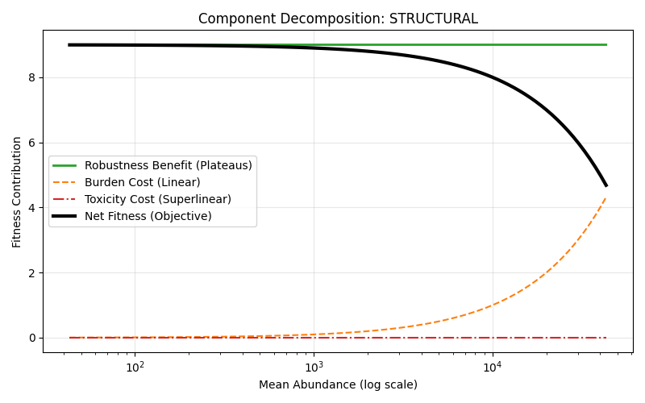

---

## D. Biological Anchors

### MYC

* Baseline: **2301.83**
* Optimal: **70.10**

Balanced trade-off between robustness and toxicity.

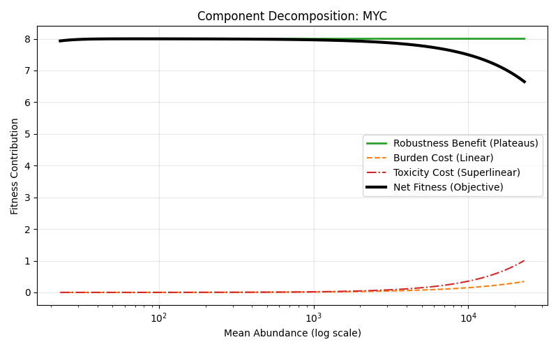

---

### KRAS

* Baseline: **1582.51**
* Optimal: **136.30**

Similar behavior, slightly higher optimal due to lower toxicity.

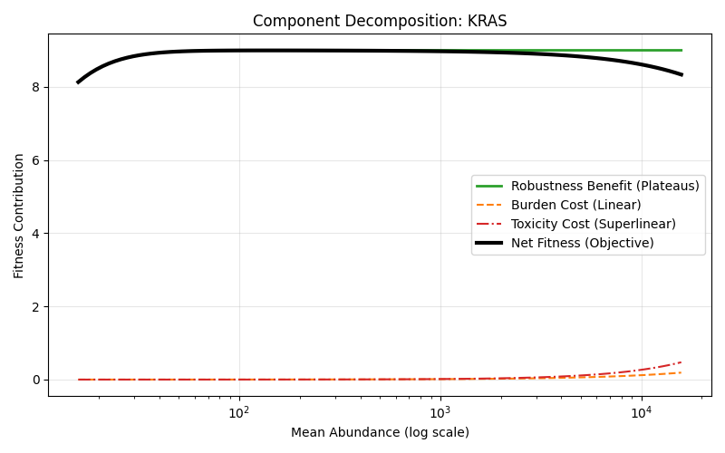

---

## E. Rare and Environment-Sensitive

### RARE_VAR — Subclonal Edge Case

* Clone fraction: **0.01**
* Baseline: **14.39**
* Optimal: **146.63**

Optimizer compensates low presence with **overexpression**.

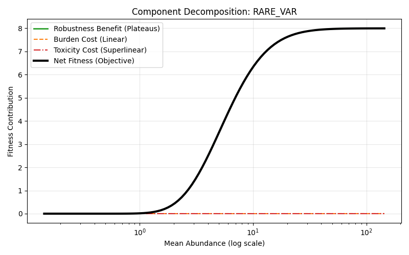

---

### FRAGILE — Stress-Sensitive Gene

* Stress sensitivity: **0.9**

* Baseline: **1474.61**

* Optimal: **140.92**

Environmental penalties reduce baseline → optimizer balances near threshold.

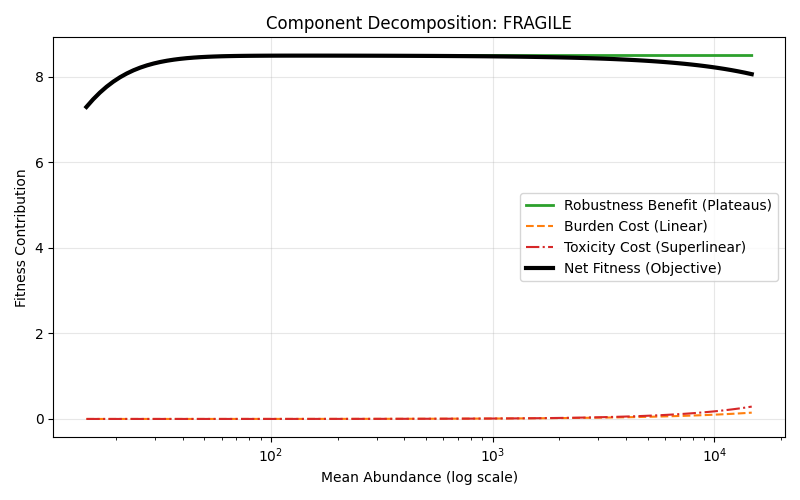

---

## 5. Global Interaction Landscapes

### MYC vs KRAS

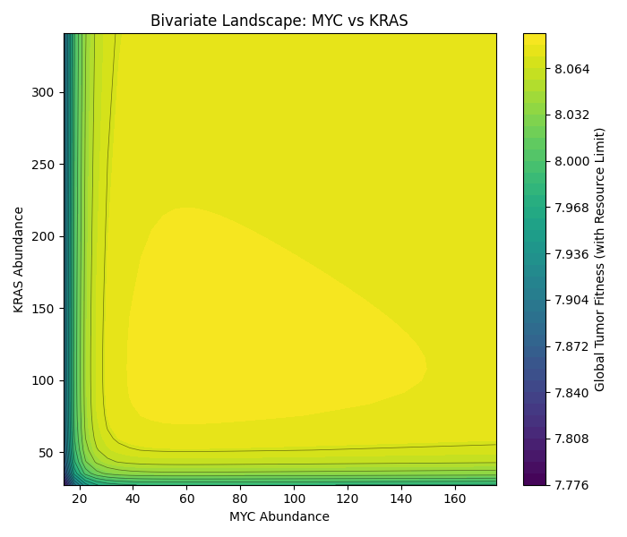

### CHAOS vs HOUSEKEEPER

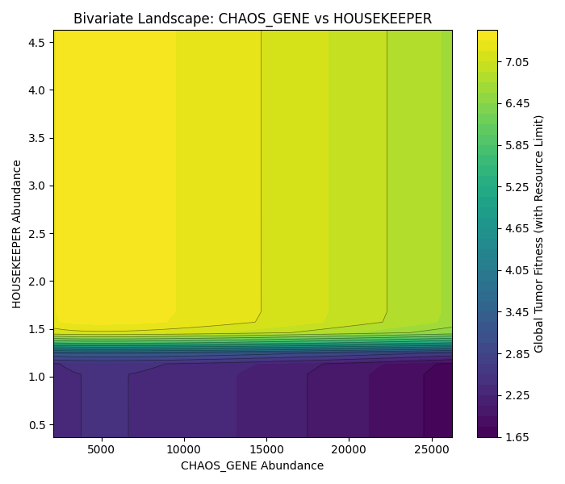

### TOXIC vs STRUCTURAL

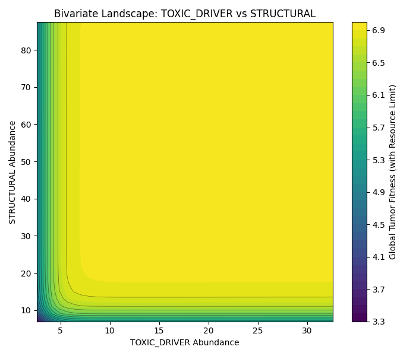

These confirm:

* No flat ridges
* No infinite compensation
* Well-defined global optima

---

## Final Assessment

The RLTO model:

* Is **numerically stable**
* Produces **biologically interpretable optima**
* Correctly handles:

    * Zero-essentiality collapse
    * Infinite-benefit saturation
    * Noise-driven amplification
    * Toxicity-driven suppression
    * Resource-constrained global trade-offs

The optimizer behaves deterministically across all stress-test regimes, validating the model as a robust computational
framework for cancer systems modeling.

The model is designed for simulation, sensitivity analysis, and optimization on bulk or single-cell omics inputs, and is
intended for use in cancer systems biology research.
