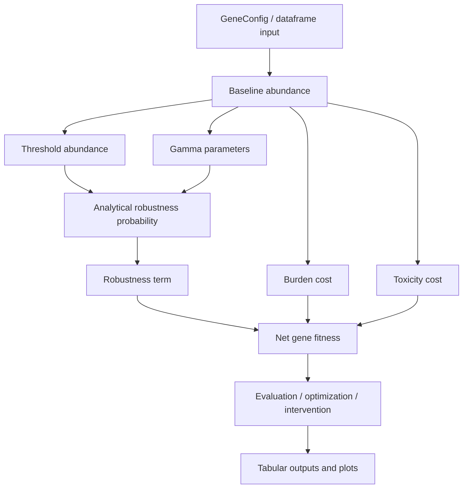

# Architecture

## Repository shape

The current repository snapshot is centered around a single module:

```text
rlto_model.py
```

That module contains:

* data containers,
* the main model,
* diagnostics utilities,
* a demo dataset,
* and a script-style demonstration entrypoint.

## Main objects

### `Microenvironment`

Encapsulates five environmental stress variables and exposes:

* clipping logic,
* aggregate `stress_index`.

### `GeneConfig`

Defines per-gene parameters and validates biological or numerical constraints.

### `ModelResult`

A structured result record returned by `net_gene_fitness()`.

### `CancerRLTOModel`

The primary API surface. It owns:

* gene configuration,
* environment,
* analytical fitness logic,
* abundance parameterization,
* optimization methods,
* pathway summaries,
* demo dataset access.

### `ModelDiagnostics`

A plotting and diagnostics layer built on top of the model.

## Internal flow



## Dataframe ingestion path

`from_dataframe()` is the practical integration point if upstream data is already tabular.

That makes the current architecture well suited to:

* notebook-based exploration,
* script pipelines,
* synthetic benchmarking,
* omics-derived feature tables prepared elsewhere.

## Plotting path

`ModelDiagnostics` uses `matplotlib` and returns figure objects. The example workflow persists them to disk with `savefig()`.

## What is not currently present

The supplied code does **not** include:

* a package layout,
* a command-line interface parser,
* configuration files,
* logging,
* typed schemas for file IO,
* tests,
* packaging metadata.

